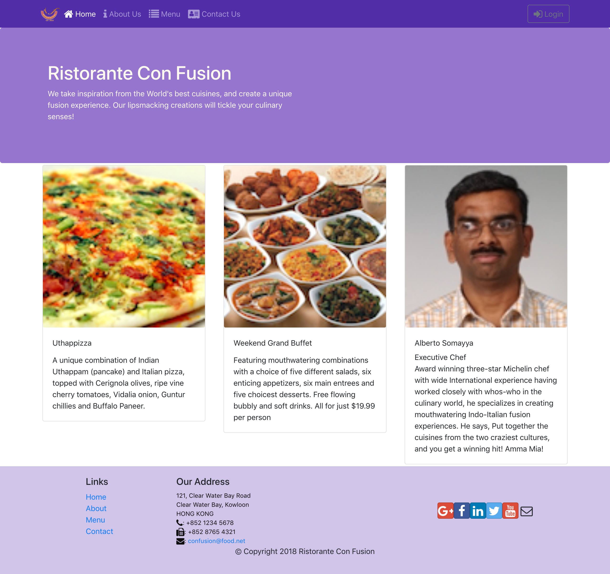
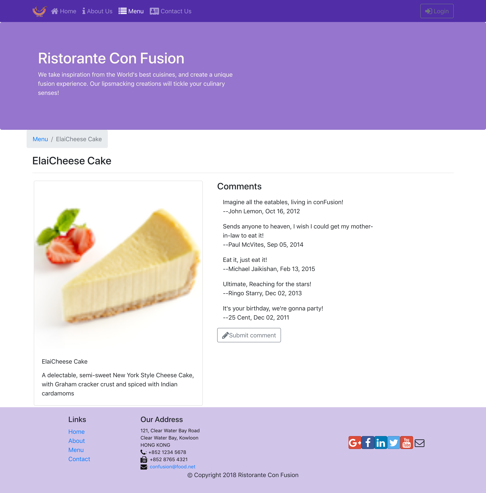
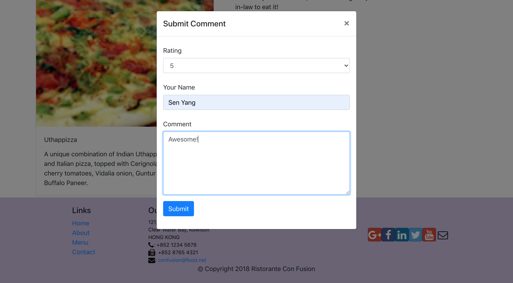
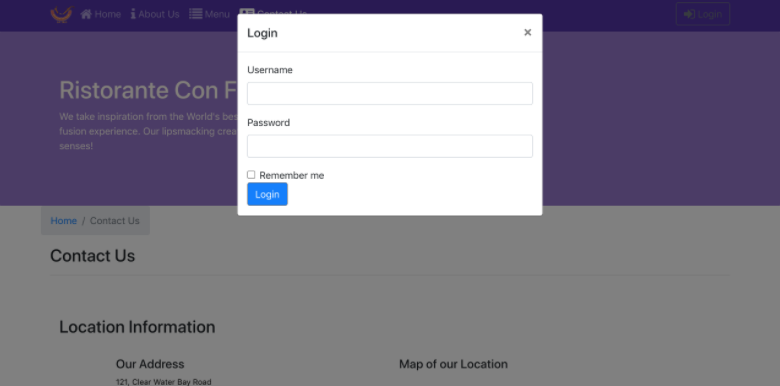
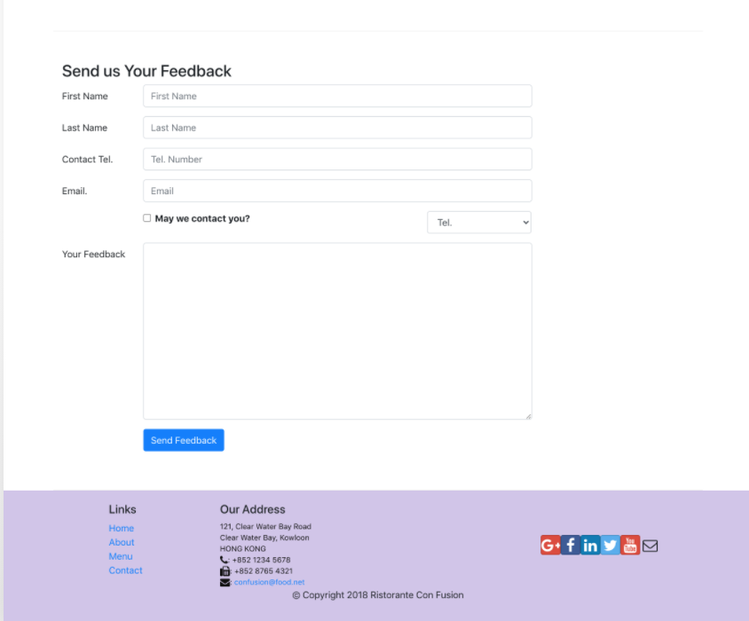

# __Web App for Resturant__

## Description
This web app is a responsive and single page web application developed for a restaurant. The web app displays information such as list of dishes, dish details (prices, description, ratings etc.) and reservation and contact info. It also allows different access rights for admins, authorized users and admins.

## How it is developed
- The front end part is devloped using React and Redux. Redux is convenient for this app because the store holds the whole state tree of and makes it easier to keep track which action causes any change.
- The back end is a Node.JS app with MongoDB using Mongoose. The mongoDB server hosts all the information such as list of dishes, comments, customer feedback and user info.

## Access rights
json web tokens and passport.js are used developed an authentication scheme that gives different types of users different access rights:
- public: can view dishes, view comments, view reviews
- authorized users: can leave comments,  reviews and feedback, delete own comments and reviews
- admin: can access feedback router, add or delete dishes, or any comments and reviews.

## Screenshot:

 
 
 
 
 
 

